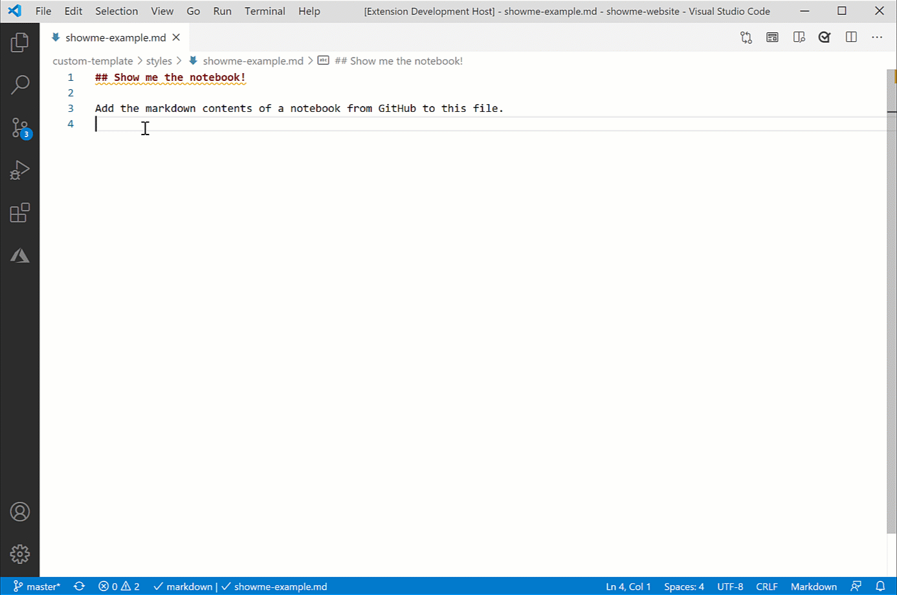

# Show Me the Notebook | Hackathon 2020

Authors: Sheri Gilley & David Pine

Insert the markdown version of a Jupyter notebook from GitHub into a document.  When the notebook content changes, you can quickly update that markdown.

There are two commands added to the command palette:

* **Show me the notebook!** - enter the URL of the notebook.  A markdown version of the notebook is added to the document starting at the position of your cursor.  Do not modify the start or end tags; it's what the next function uses to update the notebook.  

* **Update the notebook** - If there is a notebook in the document (determined by searching for the start and end tags), this function will read the URL in the start tag, re-read the notebook and replace the contents between start and end with the latest version.  If you insert multiple notebooks in the same document (why would you do that?) only the first one will be updated.

## Instructions

Use `npm install` to install dependencies.

* Open in VS Code
* **F5** to run
* Use Ctrl-Shift-P in new window
* Select **Jupyter: Show me the notebook!** then input the path to your notebook.
* select **Jupyter: Update the notebook** to update a notebook already on the page.

**Enjoy!**

